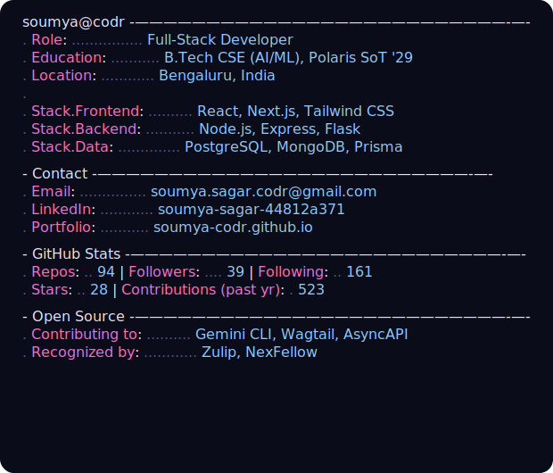

# Soumya Sagar

<table>
<tr>
<td></td>
<td></td>
</tr>
</table>

Full-stack developer (React / Node.js / Next.js) building production apps and contributing to open source. B.Tech CSE (AI & ML) student, based in Bengaluru.

Actively contributing to [Gemini CLI](https://github.com/google-gemini/gemini-cli), [Wagtail](https://github.com/wagtail/wagtail), and [AsyncAPI](https://github.com/asyncapi/asyncapi), and applying for LFX Mentorship (Docker, Kubernetes).

---

## Projects

### [MergeShip](https://github.com/Coder-s-OG-s/MergeShip)
Open-source platform that solves the "cold start" problem from both sides — gamified onboarding that trains new contributors, and an AI-assisted PR triage dashboard that cuts through low-quality noise for maintainers.

I built a hierarchical peer-mentorship pipeline that routes PRs through multiple review levels before they reach a maintainer, and used Inngest to handle idempotent background event auditing for GitHub webhook traffic at scale.

`Next.js` `React` `Supabase` `PostgreSQL` `Drizzle ORM` `Inngest` `Groq` `Vitest`
**Status:** Active — core infra and onboarding flow live, scaling out AI triage.

### [GitTogether](https://github.com/Soumya-codr/GitTogether) — [live](https://git-together-kappa.vercel.app/)
Developer matchmaking platform that goes beyond networking — uses GitHub profile and stack data to connect people for collaboration, mentorship, or learning, with a swipe-based discovery UI and real-time chat.

Built a 4-factor compatibility algorithm balancing stack overlap, repo domain similarity, activity frequency, and stated intent, plus socket-based real-time chat and room management.

`Next.js 15` `Tailwind CSS` `Framer Motion` `Node.js` `Express` `PostgreSQL` `Prisma` `NextAuth.js`
**Status:** Active, post-MVP — matchmaking engine and profile sync working, building AI-driven compatibility insights next.

### [Glyph](https://github.com/Soumya-codr/Glyph)
A macOS notch companion built in SwiftUI — turns the dead space around the camera notch into an interactive panel with a dot-matrix clock, music controls, focus timers, kanban/todos, and a clipboard shelf, all in a native frosted-glass UI.

Also hand-built a fully interactive DOM replica of the panel for the web showcase.

`Swift` `SwiftUI` `JavaScript` `CSS` `Shell`
**Status:** Active / experimental — app and web showcase both functional, refining interactions.

### [Recall](https://v0-spaced-repetition-app-wheat.vercel.app/) — [source](https://github.com/Soumya-codr/v0-spaced-repetition-app)
Spaced-repetition tool built specifically for interview prep — auto-imports LeetCode solves, tracks recall intervals against the Ebbinghaus forgetting curve, and flags topics that need review instead of relying on passive re-practice.

Built a real-time LeetCode sync engine and a revision scheduler that adjusts for problem difficulty and individual retention.

`Next.js 16` `TypeScript` `Supabase` `Tailwind CSS`
**Status:** Active — used daily to manage my own revision queue.

---

## Also built
- **DevCollab** — SaaS project management tool with JWT auth, role-based access, and real-time Kanban via Socket.io (`Next.js` `MongoDB` `Socket.io`)
- **OJT Stub Server** — config-driven local API mock server, 15+ endpoints controllable entirely via `config.json`, no code changes needed (`Python` `Flask`)

---

## Stack

**Strong:** JavaScript, React, Node.js, Express.js, Socket.io, MongoDB, REST APIs, HTML/CSS
**Familiar:** TypeScript, PostgreSQL, Prisma, Flask, Python, NextAuth.js, JWT, Tailwind CSS, Docker
**Tools:** Git, GitHub, Vercel, Postman, Figma

---

## Elsewhere
[GitHub](https://github.com/Soumya-codr) · [LinkedIn](https://www.linkedin.com/in/soumya-sagar-44812a371/) · [Portfolio](https://soumya-codr.github.io/Soumya-codr/) · soumya.sagar.codr@gmail.com
